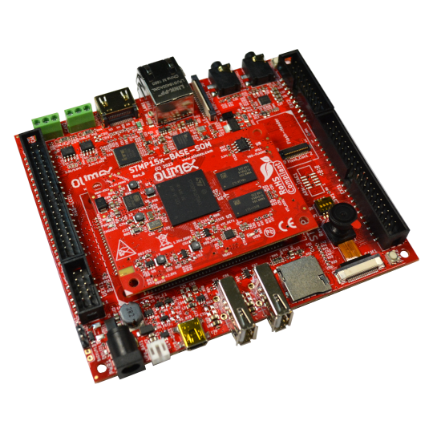

# STMP157-BASE-SOM-EVB
Evaluation board for STMP157-BASE-SOM

https://www.olimex.com/Products/SOM/STMP1/STMP157-BASE-SOM-EVB/open-source-hardware

## Features:

* 6 connectors for STMP157-BASE-SOM
* Two USB host 2.0
* USB-OTG
* Two CAN drivers
* HDMI output
* CSI OV2640-120 2Mpixel Camera
* Gigabit Ethernet
* MIPI LCD connector
* Microphone 3.5mm connector
* Headphones 3.5mm connector
* RESET button
* RGB LCD connector compatible with LCD-OLinuXino-5CTS, LCD-OLinuXino-7.0CTS, LCD-OLinuXino-10CTS
* UEXT connector
* EXT1, EXT2 connectors
* PWR connector
* LiPo charger and battery connector
* PWR LED
* DBG connector
* Flash module connector
* Boot configuration slide switch
* SD-card
* optional JTAG connector (not populated)
* Dimensions: 122 x 106 mm

## Licenses

* Hardware is released under CERN Open Hardware Licence Version 2 - Strongly Reciprocal, all silkscreen credits to Olimex should remain;
* Software is released under GPL3 Licensee
* Documentation is released under CC BY-SA 3.0